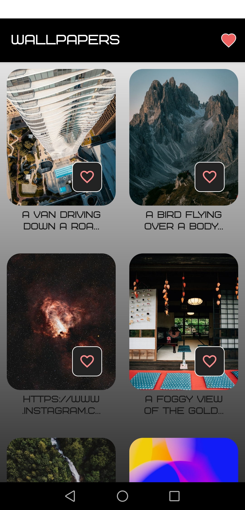
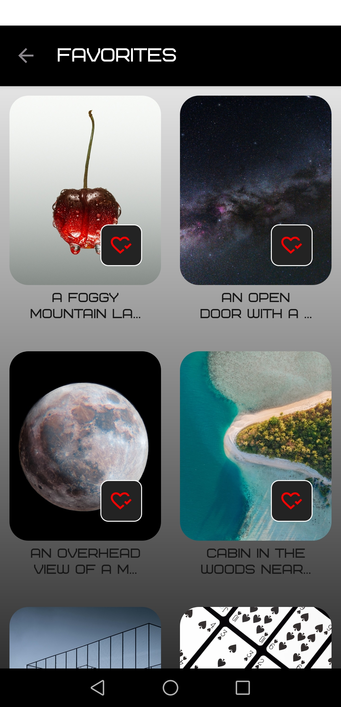
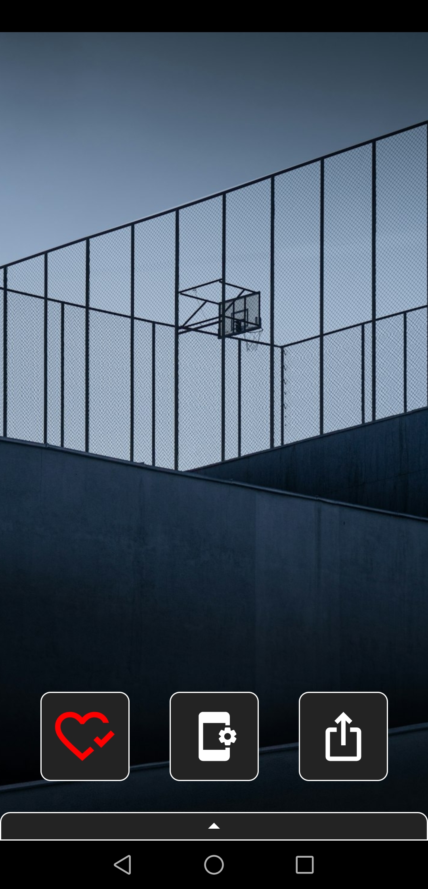
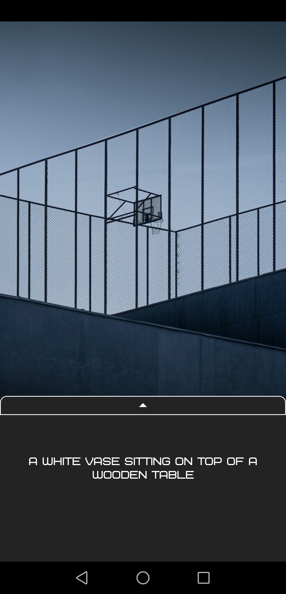

# Wallpaper application

### Application Description
This application allows you to load **images** from open **API** and set as wallpaper. You can also **save** your favorite images and **share** them with friends.

## Stack

**Platform:** Android  
**Language:** Kotlin  
**Libraries:**
* ROOM
* Retrofit2
* Glide

**Pattern:** MVVM

## About application

The application has 2 activities:
* [Walppaper List Activity](#Wallpaper-List-Activity)  
    Include:
    * [ListFragmentWeb](#Fragment-with-List-of-images-from-server)
    * [ListFragmentLiked](#Fragment-with-Favorite-wallpapers) 
* [Pick Up wallpaper activity](#Pick-Up-wallpaper-activity)  

## Wallpaper List Activity

* ### Fragment with List of images from server
    On this Fragments users can see wallpaper images loaded from server. Users can add wallpaper to Favorite list. The user can also go from this fragment to the list of liked images of pick up wallpaper to open full screen and set it as wallpaper.

    

* ### Fragment with Favorite wallpapers
    This fragment shows a list of the user's favorite images. User can go back to Fragment with List of images from server or pick up image to open it full screen. Also user can dislike wallpaper and delete it from favorite list.

    

## Pick Up wallpaper activity
* ### SelectWallpaperFragment
    This fragment allows the user to look at the selected picture in full screen, set it as wallpaper, share it with friends and add the picture to favorites.
  
      
    
    Also user can swipe up and read the full description of image
  
      

## Demo

Open application and scroll images from server

https://github.com/user-attachments/assets/8e054c9b-7aa4-4b57-bc30-5a6f9402c89c

Pick up wallpaper to lock at full screen

https://github.com/user-attachments/assets/1a2fb0fe-4c80-492b-9416-7f87cbb998be

Like image and set as wallpaper

https://github.com/user-attachments/assets/bfb93af8-fbad-4a96-8d9c-eef38bdb02d5

Look at the list of favorite images and dislike it

https://github.com/user-attachments/assets/906077c1-fd28-43d0-8f04-c2371ce935bc

Update the list of images from server, like and dislike it

https://github.com/user-attachments/assets/284f7b31-8471-436b-ab08-acc4b175e8c8

